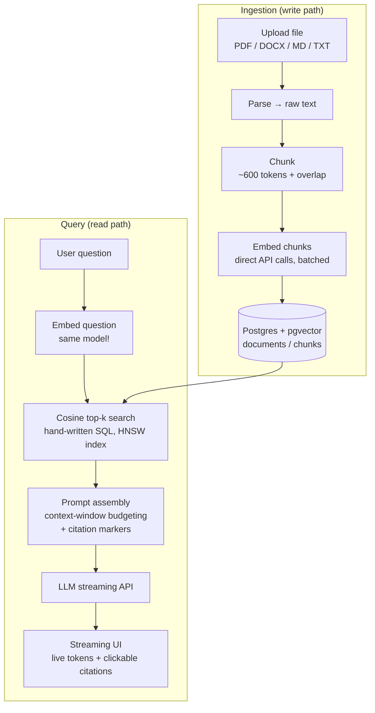

# RAG Document Chat

Chat with your own documents. Upload a PDF, DOCX, Markdown, or text file and ask questions about it — get streaming answers with inline citations pointing to the exact source passages.

Built **from scratch** as a learning project: no LangChain, no LlamaIndex, no vector-DB SDK, no ORM hiding the interesting parts. Every layer — chunking, embedding calls, vector storage, the cosine-similarity search query, prompt assembly, and token streaming — is hand-written. The only external "intelligence" is the LLM / embeddings API itself.

## What is RAG?

**Retrieval-Augmented Generation.** An LLM only knows its training data plus whatever you paste into its context window — it has never seen *your* documents. RAG fixes that:

1. **Ingest:** split your documents into chunks, convert each chunk into an *embedding* (a vector of numbers representing its meaning), and store them.
2. **Retrieve:** when a question comes in, embed the question the same way and find the stored chunks whose vectors are closest (cosine similarity).
3. **Generate:** paste those chunks into the prompt and ask the model to answer *only from that context*, citing its sources.

RAG = semantic search + prompt stuffing + generation.

**Multiple documents aren't siloed.** Retrieval searches across every chunk from every uploaded document at once — there's no per-document scoping. Ask a question that only makes sense combining two unrelated documents (e.g. "what's the pricing, and separately, where is the company based") and the top-k search naturally pulls the relevant chunks from *each* file, and the model synthesizes one answer citing both. Verified for real in `scripts/test-multi-document.ts`.

## Architecture



## Tech stack

| Concern | Choice | Why |
|---|---|---|
| Framework | Next.js (App Router) + TypeScript | One repo for API routes *and* the streaming React UI |
| UI | React + Tailwind CSS | Fast, polished frontend |
| Theme | ChatGPT-referenced light theme + one petrol accent (see `brand.md`) | Grayscale base for restraint, one accent for premium feel — light-only, no OS dark-mode switch |
| Answer rendering | `react-markdown` | Real bullet lists/paragraphs instead of raw asterisks |
| Icons | `lucide-react` | Clean, consistent icon set |
| Database | Postgres 16 + pgvector | Real SQL, real vector indexes — no separate vector service |
| DB access | `pg` (node-postgres), raw SQL | The cosine query is written by hand, on purpose |
| Embeddings | Google `gemini-embedding-001` (truncated to 1536-dim) via `fetch` | Direct HTTP calls, no SDK — and a genuinely free tier |
| LLM | Google `gemini-3.5-flash` via `streamGenerateContent` (SSE) | Direct HTTP calls, no SDK — free tier, same provider/account as embeddings |
| Tokenizer | `js-tiktoken` | Accurate chunk sizing and context budgeting |
| Parsing | `pdf-parse` (PDF), `mammoth` (DOCX) | Text extraction isn't worth reimplementing |
| Migrations | Plain `.sql` files | Schema stays visible and owned |

## Project structure

```
├─ migrations/
│  └─ 001_init.sql      # documents + chunks tables, HNSW cosine index        
├─ lib/
│  ├─ db.ts             # pg Pool                                            
│  ├─ parse.ts          # file → text (PDF/DOCX/TXT/MD)                      
│  ├─ chunk.ts          # text → token-bounded, overlapping chunks           
│  ├─ embed.ts          # batched Gemini embeddings API calls                
│  ├─ store.ts          # transactional insert of documents/chunks           
│  ├─ retrieve.ts       # hand-written cosine top-k search                   
│  └─ prompt.ts         # context budgeting + citation formatting
├─ scripts/             # standalone test-*.ts — exercise each lib/ layer
│  ├─ test-parse.ts     # npm run test:parse
│  ├─ test-chunk.ts     # npm run test:chunk
│  ├─ test-embed.ts     # npm run test:embed (calls the real Gemini API)
│  ├─ test-store.ts     # npm run test:store (full pipeline, real DB + API)
│  ├─ test-retrieve.ts  # npm run test:retrieve (semantic search + HNSW index check)
│  ├─ test-prompt.ts    # npm run test:prompt (budget, citations, empty-hit fallback)
│  ├─ test-integration.ts  # npm run test:integration (rollback, markDocumentFailed, real retrieve->assemble)
│  └─ test-chat-route.ts   # npm run test:chat-route (real end-to-end HTTP + streaming)
├─ tests/fixtures/      # real sample .txt/.md/.docx/.pdf used by the scripts above
├─ components/
│  ├─ UploadPanel.tsx   # drag/drop upload, document list, status badges, delete
│  └─ ChatPanel.tsx     # streaming answer, clickable [n] citations, empty-state
├─ app/
│  ├─ api/
│  │  ├─ upload/        # POST — parse -> chunk -> embed -> store, synchronous
│  │  ├─ documents/     # GET (list) / DELETE (cascade-deletes chunks)
│  │  └─ chat/          # retrieval + streaming answer (Gemini)
│  └─ page.tsx          # the real chat UI
├─ eval/                # Recall@k / MRR harness for tuning retrieval       ⏳
└─ CONTRIBUTING.md / LICENSE / .env.example
```

## Getting started

```bash
# 1. Install dependencies
npm install

# 2. Postgres + pgvector, running locally
#    (this repo was built against Homebrew Postgres 16; the pgvector Homebrew
#    bottle only supports newer Postgres, so it was built from source against pg16 —
#    see https://github.com/pgvector/pgvector#installation-notes if you hit the same thing)
brew install postgresql@16 && brew services start postgresql@16
createdb rag_app

# 3. Configure environment
cp .env.example .env.local
# fill in DATABASE_URL (postgresql://localhost:5432/rag_app),
# EMBEDDINGS_API_KEY and LLM_API_KEY — both free Gemini keys, same one works
# for both: https://aistudio.google.com/api-keys

# 4. Run the migration
psql rag_app -f migrations/001_init.sql

# 5. Start the dev server, then open http://localhost:3000
npm run dev
```

### Testing each layer independently

Every `lib/` module has a standalone script under `scripts/` that exercises it directly against real fixture files (and, for embeddings, the real API) — no need to run the full app to know a layer works:

```bash
npm run test:parse    # PDF/DOCX/TXT/MD → plain text
npm run test:chunk    # text → token-bounded, overlapping chunks
npm run test:embed    # chunks → real 1536-dim vectors via the Gemini API
npm run test:store    # full pipeline: parse → chunk → embed → store → verify in Postgres → cascade delete
npm run test:retrieve # ingests two unrelated docs, verifies semantic search discriminates between them, confirms HNSW index usability
npm run test:prompt   # context-window budget enforcement, citation numbering, honest empty-hit fallback
npm run test:integration  # real retrieve->assemble wiring, transaction ROLLBACK, markDocumentFailed
npm run test:chat-route   # real end-to-end: spins up next dev, ingests a doc, streams a real Gemini answer over the real route
npm run test:multi-document # ingests two distinct docs, confirms one question can retrieve + synthesize across both
```

The frontend (`app/page.tsx`, `components/`) was verified with a real headless-browser test (Playwright): upload a file → status flips to ready with a chunk count → chat input enables → ask a question → "Searching…" → streamed answer with real inline `[n]` citations → clicking a citation scrolls to and highlights its source card → removing the document clears the list and disables chat again. Zero console errors.

## Progress

- [x] Phase 0 — Postgres + pgvector running, `001_init.sql` applied, Next.js scaffolded
- [x] Phase 1 — Parsing: PDF/DOCX/TXT/MD → clean text (`lib/parse.ts`)
- [x] Phase 2 — Chunking: token-bounded, overlapping chunks (`lib/chunk.ts`)
- [x] Phase 3 — Embeddings: batched Gemini API calls, verified against real vectors (`lib/embed.ts`)
- [x] Phase 4 — Storage: insert documents + chunks in a transaction (`lib/store.ts`)
- [x] Phase 5 — Retrieval: hand-written cosine top-k query (`lib/retrieve.ts`)
- [x] Phase 6 — Prompt assembly + context-window budgeting (`lib/prompt.ts`)
- [x] Phase 7 — Generation: streaming LLM route (`app/api/chat`), Gemini `gemini-3.5-flash`
- [x] Phase 8 — Frontend: upload states, live streaming, citations UI (plus the upload/documents API routes it needed, built this phase too)
- [ ] Eval harness — Recall@k / MRR to tune chunk size and top-k against real numbers


## Contributing

Contributions are welcome — see [CONTRIBUTING.md](./CONTRIBUTING.md) for setup and guidelines.

## License

MIT © 2026 Madhu Varsha P — see [LICENSE](./LICENSE) for details.
