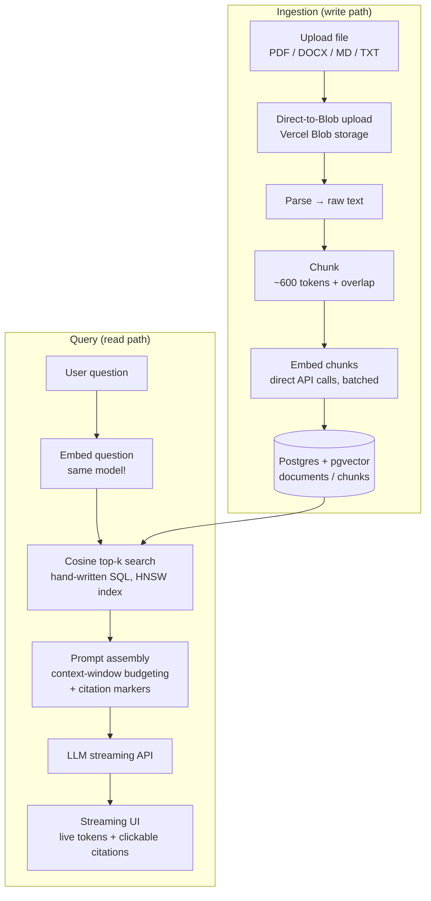

# RAG Document Chat

**Live demo:** https://rag-document-chat-application.vercel.app/

Chat with your own documents. Upload a PDF, DOCX, Markdown, or text file and ask questions about it — get streaming answers with inline citations pointing to the exact source passages.

Built **from scratch** as a learning project: no LangChain, no LlamaIndex, no vector-DB SDK, no ORM hiding the interesting parts. Every layer — chunking, embedding calls, vector storage, the cosine-similarity search query, prompt assembly, and token streaming — is hand-written. The only external "intelligence" is the LLM / embeddings API itself.

## What is RAG?

**Retrieval-Augmented Generation.** An LLM only knows its training data plus whatever you paste into its context window — it has never seen *your* documents. RAG fixes that:

1. **Ingest:** split your documents into chunks, convert each chunk into an *embedding* (a vector of numbers representing its meaning), and store them.
2. **Retrieve:** when a question comes in, embed the question the same way and find the stored chunks whose vectors are closest (cosine similarity).
3. **Generate:** paste those chunks into the prompt and ask the model to answer *only from that context*, citing its sources.

RAG = semantic search + prompt stuffing + generation.

Retrieval isn't scoped per document — it searches across every chunk from every uploaded file at once, so a single question can pull relevant chunks from multiple documents and get one synthesized, cited answer (see `scripts/test-multi-document.ts`).

## Architecture



## Tech stack

| Concern | Choice | Why |
|---|---|---|
| Framework | Next.js (App Router) + TypeScript | One repo for API routes and the streaming React UI |
| UI | React + Tailwind CSS | Light theme, one accent color, CSS variables in `app/globals.css` |
| Database | Postgres + pgvector (hosted on Neon) | Real SQL, real vector indexes, no separate vector service |
| DB access | `pg` (node-postgres), raw SQL | The cosine query is written by hand, on purpose |
| File uploads | Vercel Blob (`@vercel/blob`), direct client → storage | Vercel Functions cap request bodies at 4.5MB; direct-to-Blob upload bypasses that entirely |
| Embeddings | Google `gemini-embedding-001` (1536-dim) via `fetch` | Direct HTTP calls, no SDK — free tier |
| LLM | Google `gemini-3.1-flash-lite` via `streamGenerateContent` (SSE) | Direct HTTP calls, no SDK — free tier |
| Tokenizer | `js-tiktoken` | Accurate chunk sizing and context budgeting |
| Parsing | `pdf-parse` (PDF), `mammoth` (DOCX) | Text extraction isn't worth reimplementing |
| Answer rendering | `react-markdown` | Real bullet lists/paragraphs, not raw markdown |
| Migrations | Plain `.sql` files | Schema stays visible and owned |
| Privacy | HTTP-only session cookie (`lib/session.ts`) | Each browser session only sees, queries, and can delete its own documents — no login, no cross-visitor leakage |

## Project structure

```
├─ migrations/
│  ├─ 001_init.sql      # documents + chunks tables, HNSW cosine index
│  └─ 002_session_scope.sql # session_id on documents, for per-browser privacy
├─ lib/
│  ├─ db.ts             # pg Pool
│  ├─ parse.ts          # file → text (PDF/DOCX/TXT/MD)
│  ├─ chunk.ts          # text → token-bounded, overlapping chunks
│  ├─ embed.ts          # batched Gemini embeddings API calls
│  ├─ store.ts          # transactional insert of documents/chunks
│  ├─ retrieve.ts       # hand-written cosine top-k search
│  ├─ prompt.ts         # context budgeting + citation formatting
│  ├─ session.ts        # anonymous per-browser session cookie
│  └─ constants.ts      # shared upload limits + content-type helpers
├─ scripts/             # standalone test-*.ts — exercise each lib/ layer directly
├─ eval/                # Recall@k / MRR harness (eval/run.ts, eval/dataset.json)
├─ tests/fixtures/      # real sample .txt/.md/.docx/.pdf used by scripts + eval
├─ components/
│  ├─ UploadPanel.tsx   # drag/drop upload, document list, status, delete
│  └─ ChatPanel.tsx     # multi-turn chat, streaming answers, citations
├─ app/
│  ├─ api/
│  │  ├─ blob-upload/   # issues client tokens for direct-to-Blob uploads
│  │  ├─ upload/        # fetches the uploaded blob, runs the ingestion pipeline
│  │  ├─ documents/     # GET (list) / DELETE (cascade-deletes chunks)
│  │  └─ chat/          # retrieval + streaming answer
│  └─ page.tsx          # the chat UI
└─ CONTRIBUTING.md / LICENSE / .env.example
```

## Getting started

```bash
# 1. Install dependencies
npm install

# 2. Postgres + pgvector, running locally
brew install postgresql@16 && brew services start postgresql@16
createdb rag_app
# pgvector's Homebrew bottle only supports newer Postgres — if brew install
# pgvector fails, build it from source against pg16 instead:
# https://github.com/pgvector/pgvector#installation-notes

# 3. Configure environment
cp .env.example .env.local
# DATABASE_URL=postgresql://localhost:5432/rag_app
# EMBEDDINGS_API_KEY / LLM_API_KEY — free Gemini keys: https://aistudio.google.com/api-keys
#   (same key works for both; two separate keys is better hygiene but doesn't add quota —
#   Gemini's free tier is tracked per Google project, not per key)

# 4. Run the migrations
psql rag_app -f migrations/001_init.sql
psql rag_app -f migrations/002_session_scope.sql

# 5. Start the dev server, then open http://localhost:3000
npm run dev
```

File uploads use Vercel Blob in production; locally, uploads still go through the same code path but need `BLOB_READ_WRITE_TOKEN` in `.env.local` (from your Vercel project's Storage tab) to actually reach Blob storage.

### Testing

Every `lib/` module has a standalone script under `scripts/` that exercises it directly — no need to run the full app to know a layer works:

```bash
npm run test:parse         # PDF/DOCX/TXT/MD → plain text
npm run test:chunk         # text → token-bounded, overlapping chunks
npm run test:embed         # chunks → real vectors via the Gemini API
npm run test:store         # parse → chunk → embed → store → verify in Postgres → cascade delete
npm run test:retrieve      # semantic search discrimination + HNSW index check
npm run test:prompt        # context budget, citation numbering, empty-hit fallback
npm run test:integration   # transaction ROLLBACK, retrieve->assemble wiring
npm run test:chat-route    # end-to-end: real dev server, real streamed answer
npm run test:multi-document # one question, retrieval + synthesis across two documents
npm run eval                # Recall@k / MRR against eval/dataset.json
```

The frontend was verified with headless-browser tests (Playwright): upload → status flips to ready → ask a question → streamed answer with citations → click a citation to highlight its source → remove the document → chat disables again. Same flow re-verified against the live production URL.

## Retrieval quality: the eval harness

`npm run eval` measures retrieval quality numerically instead of eyeballing whether answers look right, using a small labeled question set (`eval/dataset.json` — each question tagged with which document should answer it):

- **Recall@k** — did the correct document show up *anywhere* in the top-k results?
- **MRR (Mean Reciprocal Rank)** — when it was found, how highly was it ranked? (1st place = 1.0, not found = 0.)

Chunk size, overlap, and top-k are tunable via env vars, so a tuning change can be measured before/after instead of guessed:

```bash
EVAL_MAX_TOKENS=150 EVAL_OVERLAP_TOKENS=30 EVAL_TOP_K=3 npm run eval
```

Current fixture set scores 100% Recall@6 / MRR 1.000 — expected given how small and topically distinct the three fixture documents are. That confirms the harness itself works correctly; a rigorous benchmark needs a larger, more ambiguous corpus.

## Deploying your own copy

1. **Hosted Postgres with pgvector** — [Neon](https://vercel.com/marketplace/neon) (Vercel's first-party Postgres integration, connects via the Storage tab, free tier, full pgvector/HNSW support). Run `migrations/001_init.sql` and `migrations/002_session_scope.sql` against it once, in order.
2. **Vercel Blob storage** — Storage tab → create a Blob store → connect it to the project. This injects `BLOB_READ_WRITE_TOKEN`.
3. **Environment variables** (Project → Settings → Environment Variables): `DATABASE_URL`, `EMBEDDINGS_API_KEY`, `LLM_API_KEY`.
4. **Redeploy**, then verify: `curl https://<your-deployment>/api/documents` should return `[]`, not `500`.

Two Vercel platform limits worth knowing:
- **Request body cap:** 4.5MB on every plan, non-configurable — why uploads go client → Blob storage directly instead of through a Function.
- **Gemini free-tier quota:** tracked per Google project *and* per model, not per API key. If you hit `RESOURCE_EXHAUSTED`, check https://aistudio.google.com/rate-limit or switch `MODEL` in `app/api/chat/route.ts` to another current Flash model.

## Progress

- [x] Phase 0 — Postgres + pgvector, Next.js scaffolded
- [x] Phase 1 — Parsing (`lib/parse.ts`)
- [x] Phase 2 — Chunking (`lib/chunk.ts`)
- [x] Phase 3 — Embeddings (`lib/embed.ts`)
- [x] Phase 4 — Storage (`lib/store.ts`)
- [x] Phase 5 — Retrieval (`lib/retrieve.ts`)
- [x] Phase 6 — Prompt assembly (`lib/prompt.ts`)
- [x] Phase 7 — Generation (`app/api/chat`)
- [x] Phase 8 — Frontend (`app/page.tsx`, `components/`)
- [x] Eval harness (`eval/`)
- [x] Production deployment — live on Vercel, hosted Postgres + Blob storage

## Contributing

Contributions are welcome — see [CONTRIBUTING.md](./CONTRIBUTING.md) for setup and guidelines.

## License

MIT © 2026 Madhu Varsha P — see [LICENSE](./LICENSE) for details.
